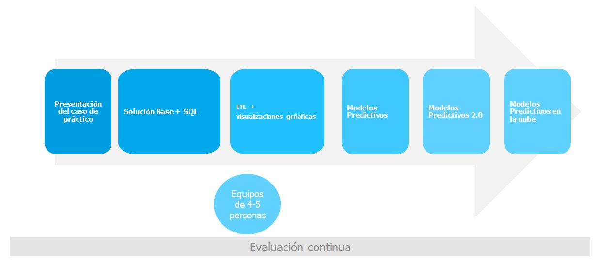

# DataExpert
# Modelo analítico predictivo para PowerGen

- **BananaData** es una empresa especializada en transformar datos en estrategias de éxito. En BananaData, estamos acostumbrados a enfrentar desafíos que requieren precisión y análisis profundo. Uno de nuestros clientes preferentes es **PowerGen**, una reconocida empresa de plantas energéticas. Se acercó a nosotros con una solicitud especial: PowerGen administra varias plantas energéticas que operan 24/7, con equipos y maquinaria que necesitan estar en condiciones óptimas. Sin embargo, los fallos inesperados en estos equipos han comenzado a causar pérdidas significativas, afectando tanto los tiempos de operación como los costes de mantenimiento.
- PowerGen quiere anticipar estos fallos antes de que ocurran y optimizar su programa de mantenimiento. Nos piden que desarrollemos un **modelo predictivo** que, no solo ayude a identificar patrones en los datos de mantenimiento, sino que también permita predecir fallos en los equipos clave, permitiendo actuar de forma proactiva y planificar el mantenimiento de manera más efectiva.
- Desde BananaData hemos diseñado un proyecto integral, una **"hoja de ruta de datos"** que incluye desde el análisis inicial hasta el desarrollo y despliegue del modelo en la nube. El modelo aprovechará **datos históricos de órdenes de trabajo, características de los equipos y registros de condiciones operativas** para anticipar los posibles puntos de fallo.
- El objetivo final es mejorar la eficiencia y seguridad de las plantas de PowerGen, aprovechando al máximo el poder de sus propios datos.

## Objetivo General

Desarrollar un modelo analítico que permita predecir fallos en equipos clave dentro de una planta energética. Utilizando datos históricos de mantenimiento, especificaciones técnicas de los equipos y registros de operación. 
El proyecto abordará la construcción de una solución de análisis predictivo que ayude a mejorar el mantenimiento preventivo, optimizar tiempos de operación y reducir costos asociados con el tiempo de inactividad no planificado.
Para ello se aprovecharán **datos históricos de órdenes de trabajo, características de los equipos y registros de condiciones operativas** para anticipar los posibles puntos de fallo.

